# Willian's Personal Blog

The blog is at [wiiliannguyen.com](https://www.williannguyen.com)

## Architecture Overview

This application follows a **full-stack Rust architecture** using:

- **Frontend**: Leptos with hydration for interactive client-side features
- **Backend**: Axum web framework with PostgreSQL database
- **Rendering**: Server-side rendering (SSR) with client-side hydration
- **Content**: Markdown-based blog posts with syntax highlighting
- **Build System**: Custom build script for static content generation

## Tech Stack

### Core Framework

- **[Leptos 0.8](https://leptos.dev/)** - Reactive web framework for Rust
- **[Axum 0.8](https://docs.rs/axum/)** - Modern async web framework
- **[Tokio](https://tokio.rs/)** - Async runtime

### Database & ORM

- **[PostgreSQL](https://www.postgresql.org/)** - Primary database
- **[SQLx 0.8](https://docs.rs/sqlx/)** - Async SQL toolkit with compile-time checked queries
- **Database Migrations** - Version-controlled schema management

### Content Processing

- **[pulldown-cmark](https://docs.rs/pulldown-cmark/)** - Markdown parser
- **[syntect](https://docs.rs/syntect/)** - Syntax highlighting for code blocks
- **Static Content Generation** - Build-time markdown processing

### Middleware & Security

- **Rate Limiting** - Per-IP request throttling using Governor
- **CORS** - Cross-Origin Resource Sharing configuration
- **CSRF Protection** - Token-based CSRF mitigation
- **Security Headers** - Comprehensive HTTP security headers
- **Request Timeout** - Configurable request timeouts
- **Compression** - Brotli compression for responses

### Development & Deployment

- **[cargo-leptos](https://crates.io/crates/cargo-leptos)** - Leptos build tool
- **Hot Reload** - Development server with live reloading
- **WASM Optimization** - Size-optimized WebAssembly builds
- **End-to-End Testing** - Playwright integration

## Project Structure

### 🌐 Frontend (Leptos)

The implementation is  obtained from cargo-leptos axum template provided from. For more detail, please follow the the [instruction](https://github.com/leptos-rs/start-axum).

```text
src/
├── app.rs                 # App component and routing
├── client.rs              # Client-side hydration entry
├── app/
│   ├── helpers.rs         # UI utility functions
│   ├── components.rs      # Component module definitions
│   ├── components/
│   ├── pages.rs
│   └── pages/             # Page module definitions
```

### ⚙️ Backend (Axum) Architecture

The backend structure seen below is over-engineered for the purpose of personal blog with only public newsletter subcriber feature.

However, the industry-graded architecture is purposely used to study fullstack technology with Rust. The architecture is learnt from the book [FullStack Rust with Axum from Martin Fabio](https://www.amazon.com/FullStack-Rust-Axum-Server-Rendered-High-Performance-ebook/dp/B0FM6XF8YX)

```text
├── main.rs                 # Application entry point
├── server.rs               # Server orchestration & middleware stack
└── server/                 # Modular backend architecture
    ├── db.rs               # Database module coordinator
    ├── db/
    │   ├── config.rs       # Database URL & connection config
    │   ├── pool.rs         # PgPool initialization & management
    │   ├── state.rs        # AppState with shared resources
    │   └── error.rs        # Database-specific error handling
    ├── middleware.rs       # Middleware module coordinator
    ├── middleware/
    │   ├── cache.rs        # HTTP caching strategies
    │   ├── governor.rs     # Rate limiting (IP-based)
    │   ├── csrf.rs         # CSRF token protection
    │   ├── throttle.rs     # Request throttling
    │   ├── global_layer.rs # Middleware layer coordinator
    │   └── global_layer/
    │       ├── cors.rs                 # Cross-Origin Resource Sharing
    │       └── security_headers.rs     # Security headers middleware
    ├── models.rs           # Data model coordinator
    ├── models/
    │   └── subscriber.rs   # Newsletter subscriber model
    ├── repositories.rs     # Data access coordinator
    ├── repositories/
    │   └── subscriber.rs   # Database queries & data access
    ├── services.rs         # Business logic coordinator
    ├── services/
    │   └── subscriber.rs   # Newsletter business logic
    ├── handlers.rs         # Request handler coordinator
    ├── handlers/
    │   └── subscriber.rs   # HTTP request/response handling
    ├── routes.rs           # API route coordinator
    └── routes/
        └── subscriber.rs   # Newsletter API endpoints
```

### 🏘️ Backend Layer Relationships

```mermaid
graph TD
  Middleware["🧩 Middleware Stack<br/>(server.rs & routes/)"]
  Middleware -->|Applied globally and per route| Routes["🛣️ Routes"]
  Routes -->|Use| Handlers["👐 Handlers"]
  Handlers -->|Use| Services["🛎️ Services"]
  Services -->|Use| Repositories["📦 Repositories"]
  Repositories -->|Use| Models["📄 Models"]
  Repositories -->|Use| DB["🗄️ DB"]
```

<div style="display: flex; gap: 2em;">
  <div style="flex: 1; min-width: 300px;">



</div>
  <div style="flex: 1; min-width: 300px;">
    <b>Middleware & Security Features</b>
      <ul>
        <li>Rate Limiting: Per-IP request throttling using Governor</li>
        <li>CORS: Cross-Origin Resource Sharing configuration</li>
        <li>CSRF Protection: Token-based CSRF mitigation</li>
        <li>Security Headers: Comprehensive HTTP security headers</li>
        <li>Request Timeout: Configurable request timeouts</li>
        <li>Compression: Brotli compression for responses</li>
      </ul>
    <b>Middleware Implementation</b>
      <ul>
        <li>Global: Applied in server.rs (compression, timeout, CORS, security headers)</li>
        <li>Route-specific: Applied in routes/ modules. For example, subscriber routes apply no_cache, governor, throttle, and CSRF layers.</li>
      </ul>
    <b>Layer Responsibilities</b>
      <ul>
        <li>Routes: HTTP endpoints + middleware application, delegate to handlers</li>
        <li>Handlers: HTTP request/response processing, input validation</li>
        <li>Services: Business logic, orchestration, transaction management</li>
        <li>Repositories: Data access queries, DB operations using models</li>
        <li>Models: Data structures, serialization, validation rules</li>
        <li>DB: Connection pooling, configuration, state management</li>
      </ul>
  </div>
</div>

## Build System

The project uses a custom build script (`build.rs`) that:

1. **Processes Markdown Files**: Reads blog posts from `contents/posts/`
2. **Syntax Highlighting**: Applies code highlighting using Syntect
3. **Static Generation**: Converts markdown to HTML at build time
4. **Optimized Output**: Generates Rust code with static post data

## Performance Features

- **Server-Side Rendering (SSR)**: Fast initial page loads
- **Hydration**: Interactive client-side features without full SPA overhead
- **Static Content**: Build-time markdown processing reduces runtime overhead
- **Compression**: Brotli compression for smaller payload sizes
- **Connection Pooling**: Efficient database connection management
- **Request Timeout**: Prevents long-running requests from blocking resources
- **HTTP Caching Strategy**: Multi-tier caching system for optimal performance
- **WASM Optimization**: Aggressive size optimization for client-side bundles

## WASM Bundle Optimization

The WebAssembly build process includes several standard optimization techniques to minimize bundle size:

### Optimization Techniques

- Size-focused compilation (opt-level = 'z')
- Link-time optimization (LTO)
- Strip debug symbols (strip = true)
- Abort on panic (panic = "abort")
- Single codegen unit
- Use wee_alloc for smaller WASM allocator

### Benchmark Results

Below information is  obtained from the actual implementation on the project and get benchmark to show the efficency of these technuques.

| Metric | Before Optimization | After Optimization | Improvement |
|--------|--------------------|--------------------|-------------|
| **Bundle Size** | 8.5MB | 1.5MB | **82.4% smaller** |
| **Gzipped Size** | ~2.1MB | ~400-600KB | ~75% smaller |
| **Load Time Impact** | Baseline | Significantly improved | 5.6x smaller |

### Impact

- **Faster page loads**: 82% smaller WASM bundles load much faster
- **Reduced bandwidth**: Significant savings in data transfer
- **Better mobile experience**: Smaller bundles improve performance on slower connections
- **Production ready**: Size is now within reasonable limits for web deployment

## Caching

Deploy standard industry practices

- **Static Assets:**
  - Uses `Cache-Control: public, max-age=31536000` for 1-year caching.
  - Assets are versioned for cache busting, ensuring users get updates when files change.
- **API Responses:**
  - Uses `Cache-Control: public, max-age=60` for short-term caching (1 minute).
  - Improves performance for read-only endpoints and reduces database load.
- **Sensitive/Dynamic Endpoints:**
  - Uses `Cache-Control: no-store` to prevent caching of user actions and sensitive data.

## Future Features

- Centralized Error Handling (**Status**: Planned)

Will add a middleware layer to catch errors, log them, and provide consistent user-friendly responses. Implementation is postponed until the app grows in complexity.

- Modulized global layer (**Status**: Planned)

This was planned out at the begginning with `tower` crate 's ServiceBuilder as a global layer which is then called into server.rs.

However, refactoring this seperated out from server.rs run is more troublesome than expected.

Until the project expands further, it is placed directly in server.rs.

## Reference

- Book [FullStack Rust with Axum from Martin Fabio](https://www.amazon.com/FullStack-Rust-Axum-Server-Rendered-High-Performance-ebook/dp/B0FM6XF8YX)
- [Leptos resources](https://leptos.dev/)
- [awesome-leptos repo](https://github.com/leptos-rs/awesome-leptos)
- The wild internet, AIs and various other sources...
